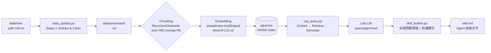

# HW3：個人知識 RAG 系統 —— 產業分析師助手

## 1. 專案簡介
- **知識主題**：產業分析師 (Investment & Industry Analyst)
- **選擇理由**：本系統旨在輔助投資分析決策。由於投資領域廣泛，系統設計為「主題驅動型」，能根據研究需求動態擴充資料庫。透過 RAG 代理人分析大量專業報告，能大幅提升從原始資料到投資洞察的萃取效率。
- **資料來源與規模**：目前收集 **25 份 PDF 與 TXT 檔案**，內容涵蓋各大券商研究報告、專業研調機構之產業分析與官方標準文件，現階段資料核心聚焦於 **「光通訊產業與矽光子技術」**。
- **系統架構概述**：本專案採用 pgvector 作為向量資料庫，搭配本地端 sentence-transformers 的 `paraphrase-multilingual-MiniLM-L12-v2` 模型進行多語言向量化，並透過 LiteLLM 統一介面串接教授提供的 gemma4 模型。系統實作了完整的兩階段 ETL 資料管線，具備 hash-based 增量更新與 `--rebuild` 全量重建能力，並自動化生成分析師視角的技能文件（skill.md）。

## 2. 系統架構說明



## 3. 設計決策說明 (Design Decisions)

### 3.1 Chunking 策略
採用 LangChain 的 `RecursiveCharacterTextSplitter`，設定 `chunk_size=300`、`chunk_overlap=50`。
券商研究報告文字密度高，常包含多個數據與公司名稱。若 chunk 過大（如 1000 字元），向量語意會被稀釋導致相似度命中率下降；若過小（如 100 字元），則上下文不足。300 字元約等於一至兩個完整論述句，實測在光通訊主題下能精準匹配具體問題。`overlap=50` 則確保跨 chunk 邊界的語句不會被硬切斷。

### 3.2 Embedding 模型選擇
選用 `sentence-transformers/paraphrase-multilingual-MiniLM-L12-v2`（維度 384）。
報告內容多為中英夾雜（術語為英文，敘述為中文），此模型對中英混合語境的語意捕捉優於英文專用模型。模型可完全在本地端離線執行，無速率限制、無 API 呼叫費用與隱私風險，適合批次處理大量文件。

### 3.3 Vector DB 選型
選擇 `pgvector`（PostgreSQL 擴充），搭配 **HNSW** 索引（`m=16, ef_construction=64`）。
PostgreSQL 提供強大的資料一致性與複合 SQL 查詢能力（有利於未來擴充 metadata 過濾）。選擇 HNSW 而非 IVFFlat，是因為 HNSW 不要求龐大的初始資料量即可建立高精度索引，且支援動態插入，更符合本系統「增量更新」的設計。

### 3.4 Retrieval 策略
- **Top-K = 5**：300 字元的 chunk 取 5 個，總長度適中，能確保在 gemma4 的 context window 內提供足夠的來源多樣性。
- **相似度門檻 = 0.3**：過濾 cosine similarity 低於 0.3 的 chunk，剔除雜訊段落，避免 LLM 產生幻覺。

### 3.5 Prompt Engineering
System prompt 採用嚴格的「Context-only」策略，要求模型僅根據 Context 回答，若無資訊則明確拒絕，避免捏造影響投資判斷的假數據。
程式層實作「保底引用輸出」，無論 LLM 是否遵從指令，終端機皆會強制顯示檢索來源。多輪對話歷史採「輕量歷史」策略，僅儲存原始問答，不記錄檢索到的 chunks，防止 context 膨脹。

### 3.6 Idempotency 設計
- **Stage 1（萃取與清理）**：透過 SHA-256 hash 紀錄已處理檔案，支援增量更新。
- **Stage 2（向量化與寫入）**：`--rebuild` 會觸發 `TRUNCATE TABLE` 清空資料表後全量重建。兩階段解耦確保維護彈性。

### 3.7 `skill_builder.py` 問題設計
為產出符合外資券商水準的報告，系統設計 10 個全域問題進行知識萃取，對應邏輯如下：
- **q01 主題範疇 (Overview)**：定位這份知識庫能解答什麼。
- **q02 核心概念 (Core Concepts)**：建立術語與框架清單。
- **q03 市場趨勢 (Key Trends)**：萃取趨勢並包含驅動因子。
- **q04 重要實體 (Key Entities)**：進行公司、機構、人物分類。
- **q05 分析框架 (Methodology)**：統整估值方法與 KPI 指標。
- **q06 風險因子 (Methodology)**：執行多面向風險分析。
- **q07 資料邊界 (Knowledge Gaps)**：誠實說明系統限制。
- **q08-09 代表問答 (Example Q&A)**：涵蓋「估值」與「策略」兩類典型問題。
- **q10 來源清單 (Source References)**：直接從 chunk metadata 彙整確保真實性。

## 4. 環境設定與執行方式

> **開發環境聲明：** 本專案於 **Python 3.14.3** 環境下開發與測試。

請依序在終端機執行以下指令，以確保能在乾淨環境中完整複現本 RAG 系統：

```bash
# 1. 確認 Python 版本 (需 >= 3.10)
python3 --version

# 2. 建立並啟動虛擬環境
python3 -m venv .venv
source .venv/bin/activate  # Windows 環境請使用: .venv\Scripts\activate

# 3. 安裝套件
pip install -r requirements.txt

# 4. 設定環境變數
cp .env.example .env
# 請於 .env 填入 LITELLM_API_KEY 與 LITELLM_BASE_URL
# 確認 PGVECTOR_CONNECTION_STRING 的帳密與 docker-compose.yml 一致（預設已對應）

# 5. 啟動 Vector DB (pgvector)
docker compose up -d
docker compose ps  # 確認 rag_pgvector 容器狀態為 running（healthy）

# 6. 全量重建索引與寫入資料庫
python data_update.py --rebuild

# 7. 測試 RAG 問答
python rag_query.py --query "請問這個知識庫涵蓋了哪些主要趨勢？"

# 8. 生成 Skill 文件
python skill_builder.py --output skill.md
```
**複現完整性確認清單（繳交前自行驗證）：**
 
- [x] `git clone` 後能按照上述順序無誤執行所有指令
- [x] `docker-compose.yml` 使用相對路徑（`./docker/pgdata`）
- [x] `.env.example` 存在且不含真實 API Key 
- [x] `requirements.txt` 第一行有 Python 版本備註 
- [x] `data/processed/` 中有清理後的 `.txt` 檔案（已 commit）
- [x] `python data_update.py --rebuild` 執行後無 Error，pgvector 有資料
- [x] `python rag_query.py --query "..."` 能回傳含引用來源的答案


## 5. 資料來源聲明

| 來源名稱 | 類型 | 授權 / 合規依據 | 數量 |
|---|---|---|---|
| 國際標準組織 (OIF) | PDF | 公開標準文件 | 3 份 |
| 台灣政府機關 (經濟部) | PDF | 政府公開資訊 | 2 份 |
| 新聞媒體與雜誌 | PDF | 媒體公開報導 | 5 份 |
| 金融機構與券商 (凱基、富邦等) | PDF | 法人機構發布文件 | 8 份 |
| 企業與研調機構 (Marvell、TrendForce) | PDF | 企業公開資訊 | 4 份 |
| 獨立網誌與自媒體 | PDF | 網路公開資訊 | 3 份 |

## 6. 系統限制與未來改進
- **多跳推理（Multi-hop Reasoning）能力有限**：若問題需要跨越多份不同報告才能得出結論（如時序性的市占率變化），系統易遺漏資訊。未來可引入 GraphRAG 建立知識圖譜。
- **PDF 表格圖表語意遺失**：`pypdf` 對複雜表格結構保留較弱。未來可引入 `pdfplumber` 進行結構化萃取，或採用 Multi-modal RAG。
- **Embedding 領域專業度上限**：通用多語言模型對高度專業的術語（如 `coherent DSP`）精度有限。未來可透過 fine-tuning 調整向量空間。
